## 들어가며

개인 홈페이지를 운영하면서 새로운 글과 페이지가 계속 추가되다 보니 **사이트 전체의 품질을 일관된 기준으로 확인하는 작업**이 필요해졌다.

제목과 Description은 적절한지, 글의 구조와 문장은 자연스러운지, 이미지의 `alt`는 빠지지 않았는지, SEO나 접근성 측면에서 개선할 부분은 없는지 등을 페이지마다 확인해야 했다.

특히 이런 항목 중에는 단순한 Rule만으로 판단하기 어려운 것들이 있다.

> 이 글의 제목과 Description이 실제 내용을 잘 표현하고 있는가?

> 처음 방문한 사람이 읽었을 때 글의 흐름이 자연스러운가?

이러한 문제는 페이지의 **문맥과 의미를 이해해야 판단할 수 있다는 점에서 LLM을 활용하기 적합한 영역**이라고 생각했다.

그래서 `sitemap.xml`을 기반으로 웹사이트 전체 페이지를 순회하고, 각 페이지의 구조와 콘텐츠를 LLM에게 전달하여 개선점을 자동으로 분석하는 간단한 **Website Review Agent**를 구현했다.

구현은 Python 단일 스크립트(`agent.py`)로 유지했고, `BeautifulSoup`으로 HTML을 요약한 뒤 OpenAI 호환 Chat Completions API(`gpt-4o-mini`)에 넘기는 구조다.

## Architecture

전체 구조는 최대한 단순하게 구성했다.

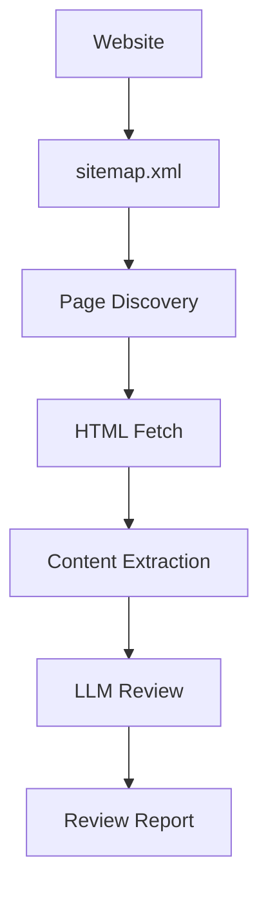

`sitemap.xml`에서 공개된 페이지 URL을 수집한 뒤 각 페이지의 HTML을 가져온다.  
sitemap index(`<sitemap><loc>`)도 재귀적으로 읽고, 중복 URL은 제거한다.

HTML 전체를 그대로 LLM에게 전달하지 않고 `BeautifulSoup`으로 검수에 필요한 정보만 추출한다.

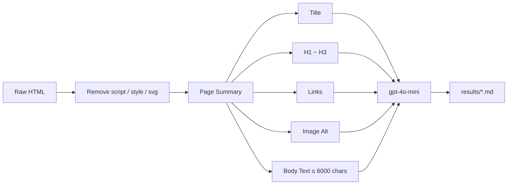

정리된 Page Context를 LLM에 전달해 **UI / Content / Accessibility / SEO / Wording** 관점의 개선사항을 생성하고, 페이지별로 `results/` 아래 Markdown Report로 저장한다.

실제 구현에서 한 가지 더 신경 쓴 부분은 **호스트 재작성**이다.  
로컬 Jekyll 빌드의 sitemap에는 `0.0.0.0:4000` 같은 주소가 들어갈 수 있다. Agent는 config의 `url` 기준으로 호스트를 치환해, 실제로 접속 가능한 주소로 페이지를 fetch한다.

## LLM을 어디에 사용해야 할까?

이 Agent를 설계하면서 중요하게 생각한 것은 **LLM으로 무엇을 할 수 있는가보다, 무엇을 LLM에게 맡겨야 하는가**였다.

예를 들어 다음 질문은 LLM이 없어도 충분히 해결할 수 있다.

- 이미지에 `alt` 속성이 존재하는가?
- 페이지에 `H1`이 존재하는가?
- Meta Description이 존재하는가?
- 링크가 정상적인 HTTP Response를 반환하는가?

이러한 문제에는 명확한 정답과 검증 방법이 존재한다.

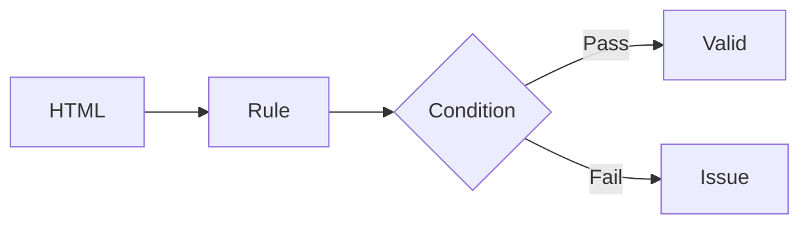

반면 다음 질문에는 명확한 Rule을 정의하기 어렵다.

- 제목이 본문의 핵심을 잘 표현하는가?
- Description만 읽어도 페이지의 목적을 이해할 수 있는가?
- 문단의 흐름이 자연스러운가?
- 설명이 지나치게 반복되지는 않는가?
- 처음 방문한 독자에게 필요한 맥락이 충분한가?

예를 들어 Description의 길이가 150자인지는 코드로 확인할 수 있지만, **그 150자가 본문의 핵심을 제대로 설명하고 있는지**는 글 전체의 의미를 함께 봐야 한다.

여기서 LLM의 역할이 생긴다.

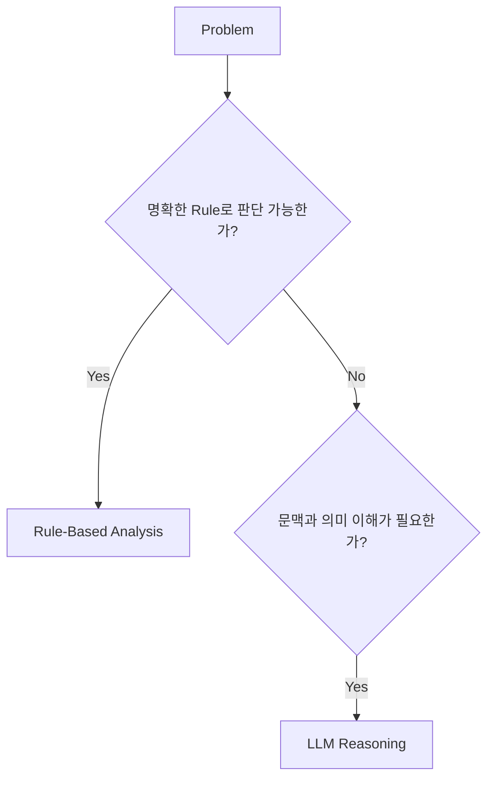

따라서 이 Agent를 발전시킨다면 모든 검수를 LLM에게 맡기기보다 다음과 같이 역할을 분리하는 것이 더 적절하다고 생각한다.

```text
Deterministic Analysis  →  Code
Semantic Analysis       →  LLM
```

LLM을 더 많이 사용하는 것이 중요한 것이 아니라, **LLM이 필요한 문제를 구별하는 것**이 먼저다.

## LLM을 사용한다면, Context를 어떻게 구성할 것인가?

LLM을 사용할 문제를 정했다면 다음 문제는 **무엇을 모델에게 보여줄 것인가**이다.

현재 Agent가 HTML 전체를 그대로 전달하지 않는 이유도 여기에 있다.

웹페이지에는 본문뿐만 아니라 `script`, `style`, navigation, SVG 등 검수와 직접적인 관련이 없는 정보가 함께 존재한다.

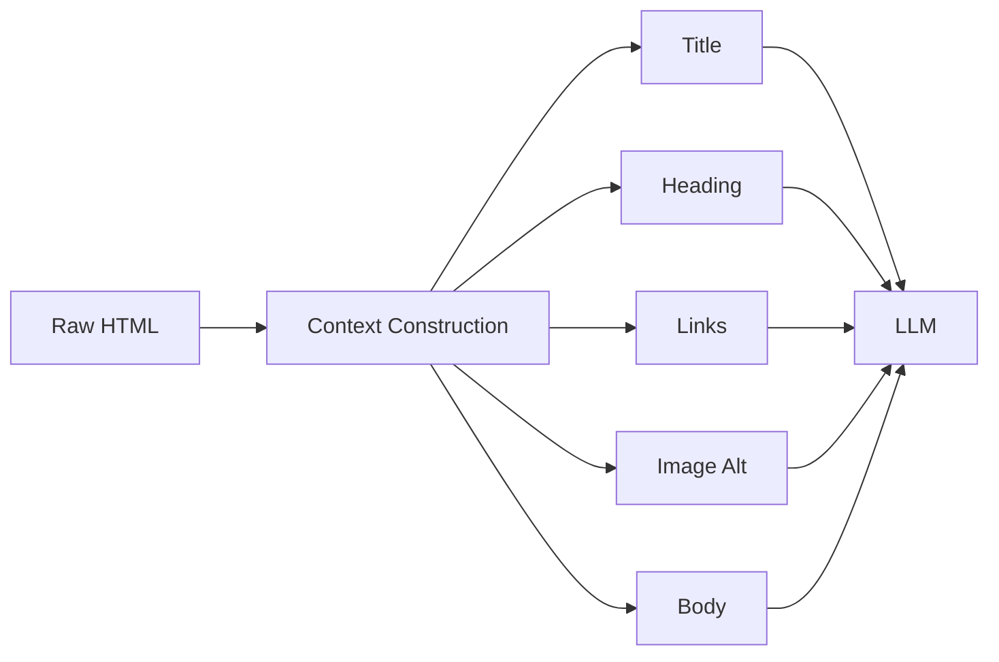

즉 LLM에게

> "이 페이지를 분석해줘."

라고 요청하기 전에 먼저 **모델이 판단에 필요한 Evidence가 무엇인지 정의하는 과정**이 필요하다.

정보가 부족하면 모델은 충분한 판단을 하기 어렵고, 반대로 관련 없는 정보를 지나치게 많이 제공하면 Token Cost가 증가하고 중요한 정보가 Context 속에 묻힐 수 있다.

결국 LLM 기반 시스템에서는 Prompt뿐만 아니라

```text
무엇을 수집할 것인가?
        ↓
무엇을 제거할 것인가?
        ↓
어떤 구조로 표현할 것인가?
        ↓
어떤 판단을 요청할 것인가?
```

까지 함께 설계해야 한다.

이 관점에서 현재 `page_summary()`는 단순한 HTML 요약 함수라기보다 **LLM이 판단할 Context를 구성하는 단계**라고 볼 수 있다.

## Prompt Engineering: 무엇을 어떻게 판단하게 할 것인가?

Context를 구성했다면 다음 문제는 **LLM에게 어떻게 판단하도록 할 것인가**이다.

현재 구현에서 사용하는 Prompt는 의도적으로 단순하다.

```text
아래 페이지 요약을 보고
UI·콘텐츠·접근성·SEO·문구 측면에서
구체적이고 실행 가능한 개선점을 작성하라.
```

즉, 현재 Agent는 Page Context를 제공하고 몇 가지 평가 관점만 지정한 뒤 LLM이 스스로 문제를 발견하도록 하는 **Zero-shot에 가까운 방식**이다.

작은 개인 프로젝트에서는 이 정도로도 꽤 유용한 결과를 얻을 수 있다.

하지만 검수 결과를 하나의 **평가(Evaluation)**로 생각하기 시작하면 이야기가 달라진다.

예를 들어 동일한 페이지에 대해 단순히

> "SEO 관점에서 검수해줘."

라고 요청하는 것과,

> "Title과 Description이 본문의 핵심을 대표하는지, Heading 구조가 콘텐츠의 계층을 적절히 표현하는지, Internal Link가 관련 콘텐츠 탐색에 기여하는지를 기준으로 평가해줘."

라고 요청하는 것은 같은 SEO 검수라도 판단의 기준 자체가 다르다.

결국 Prompt Engineering에서 중요한 것은 단순히 **더 자세한 Prompt를 작성하는 것**이 아니라,

> **모델이 무엇을 근거로, 어떤 기준에 따라, 어떤 형태로 판단해야 하는지를 명시하는 것**

이라고 생각한다.

### 1. Evaluation Rubric

가장 먼저 적용해볼 수 있는 것은 평가 기준을 명시적으로 정의하는 것이다.

현재의

```text
UI / Content / Accessibility / SEO / Wording을 검수하라.
```

라는 지시를 다음과 같이 구체화할 수 있다.

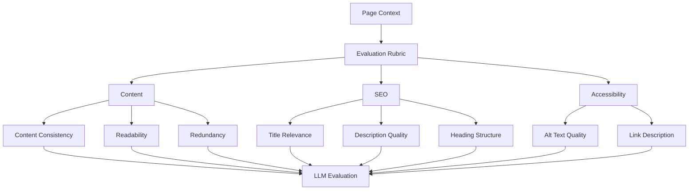

예를 들어 Content를 평가한다면 단순히 "글이 좋은가?"를 묻는 것이 아니라,

```text
[Content]
1. 제목과 본문의 핵심 내용이 일치하는가?
2. 문단 사이의 논리적 흐름이 자연스러운가?
3. 동일한 설명이 불필요하게 반복되지 않는가?
4. 독자가 이해하기 위해 필요한 맥락이 제공되는가?
```

와 같이 **판단 기준을 먼저 정의**할 수 있다.

이렇게 하면 Prompt는 질문이 아니라 일종의 **Evaluation Protocol**에 가까워진다.

### 2. Evidence-Grounded Evaluation

평가 기준만큼 중요하다고 생각하는 것은 **왜 그렇게 판단했는지를 확인할 수 있는가**이다.

예를 들어 LLM이

> "Description이 본문의 핵심을 충분히 설명하지 못합니다."

라고 판단했다고 해보자.

단순히 개선 의견만 반환하게 하는 대신,

```text
Issue
Evidence
Reason
Suggestion
```

을 함께 생성하도록 만들 수 있다.

```json
{
  "category": "content",
  "issue": "Description이 본문의 핵심을 충분히 설명하지 못함",
  "evidence": "본문에서는 LLM 기반 검수 구조와 Context Engineering을 다루지만 Description에는 해당 내용이 충분히 드러나지 않음",
  "reason": "Description과 실제 페이지의 핵심 주제 사이에 의미적 차이가 있음",
  "suggestion": "Context Engineering과 LLM 기반 검수라는 핵심 내용을 Description에 포함"
}
```

이렇게 하면 LLM의 출력은 단순한 의견에서 **Evidence를 포함한 판단**으로 바뀐다.

```text
Page Context
     ↓
Evaluation Rubric
     ↓
Evidence Selection
     ↓
Reasoning
     ↓
Recommendation
```

특히 검수 Agent에서는 단순히 Score를 생성하는 것보다 **어떤 페이지 정보에 근거해 문제라고 판단했는지 추적할 수 있는 구조**가 더 중요하다고 생각한다.

### 3. Structured Output

현재 Agent는 자연어 Bullet을 그대로 Markdown에 저장한다.

사람이 읽기에는 편하지만 이후 결과를 비교하거나 다른 시스템과 연동하기에는 한계가 있다.

따라서 출력 형식도 Prompt Engineering의 일부로 볼 수 있다.

```json
{
  "content": {
    "score": 8,
    "issues": [
      {
        "severity": "medium",
        "evidence": "...",
        "reason": "...",
        "suggestion": "..."
      }
    ]
  },
  "seo": {
    "score": 7,
    "issues": []
  },
  "accessibility": {
    "score": 9,
    "issues": []
  }
}
```

이런 구조라면 결과를 Markdown으로 보여주는 것뿐 아니라,

```text
LLM
 ↓
Structured Output
 ↓
Database
 ↓
Dashboard / CI / Comparison
```

처럼 다른 시스템에서도 활용할 수 있다.

즉 **LLM의 출력 역시 다음 단계에서 사용할 수 있는 Interface로 설계할 필요가 있다.**

### 4. Few-shot Prompting

평가 기준을 글로 설명하는 것만으로 원하는 판단 기준이 충분히 전달되지 않을 수도 있다.

이 경우에는 실제 검수 사례를 Example로 제공하는 **Few-shot Prompting**도 적용할 수 있다.

예를 들어,

```text
[Example]

Title:
"About"

Body:
LLM 기반 Software Engineering과 AI Security 연구 소개

Bad Review:
- 제목을 수정하는 것이 좋습니다.

Better Review:
- "About"만으로는 페이지의 핵심 내용을 파악하기 어렵습니다.
- 본문이 LLM 기반 Software Engineering과 AI Security 연구를 중심으로 구성되어 있으므로,
  연구 주제를 드러내는 제목을 고려할 수 있습니다.
```

처럼 원하는 평가 방식의 예시를 제공할 수 있다.

이를 통해 단순히 **어떤 결과를 원하는가**뿐 아니라 **어떤 방식으로 판단하기를 원하는가**까지 모델에게 보여줄 수 있다.

다만 Example을 추가하면 Context와 Token Cost 역시 증가하기 때문에, 실제로 Zero-shot보다 검수 품질과 일관성이 개선되는지는 비교해볼 필요가 있다.

### 5. Prompt의 품질도 평가해야 한다

Prompt Engineering에서 또 하나 중요한 부분은 **Prompt를 작성했다고 끝나는 것이 아니라는 점**이다.

예를 들어 세 가지 Prompt를 만들었다고 해보자.

```text
Prompt A
Simple Instruction

Prompt B
+ Evaluation Rubric

Prompt C
+ Evaluation Rubric
+ Few-shot Examples
+ Structured Output
```

그러면 어느 Prompt가 더 길고 복잡한지를 비교하는 것이 아니라,

```text
평가 기준을 얼마나 잘 따르는가?
근거 없는 지적은 얼마나 발생하는가?
반복 실행했을 때 결과가 얼마나 일관적인가?
실제 사람이 보기에 유용한 개선점을 얼마나 제공하는가?
Token Cost는 얼마나 증가하는가?
```

를 비교해야 한다.

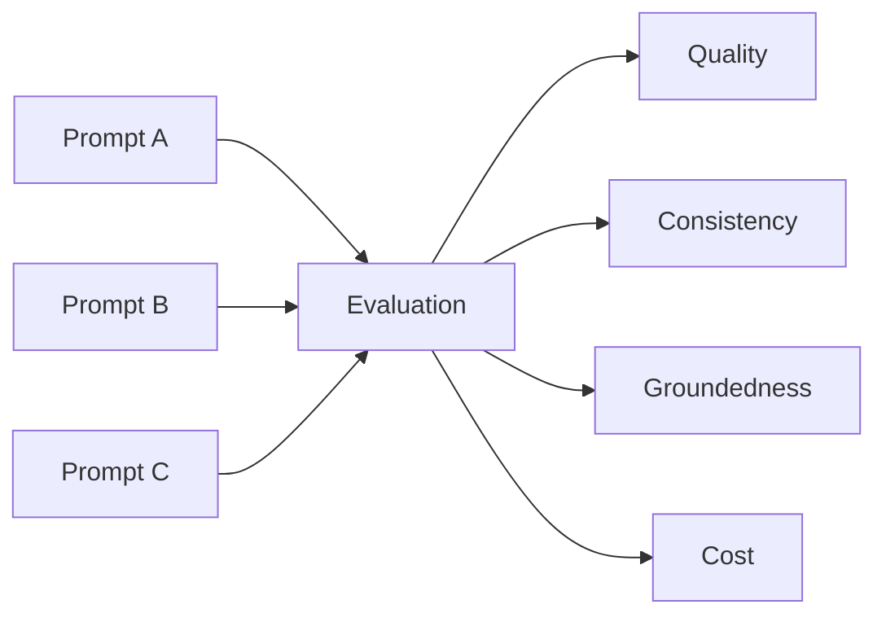

결국 Prompt Engineering 역시 감각적으로 문장을 고치는 작업이 아니라 **Prompt에 따른 모델의 행동 변화를 측정하고 개선하는 반복적인 과정**으로 볼 수 있다.

현재 Agent에서는 단순한 Prompt만 사용하고 있지만, 앞으로는 이러한 방식으로 Prompt를 단계적으로 구조화하고 실제 검수 결과가 어떻게 달라지는지 비교해보고 싶다.

## Prompt Engineering에서 Multi-Agent로

여기서 한 가지 질문이 생긴다.

> Prompt를 충분히 잘 설계하면 하나의 LLM으로 모든 검수를 수행할 수 있지 않을까?

가능하다면 그 방법이 가장 단순하다.

Multi-Agent System을 사용하기 전에 먼저 **Single-Agent에서 Context와 Prompt를 충분히 구조화해보는 과정**이 필요하다고 생각한다.

하지만 검수 범위가 커지면서 Content, SEO, Accessibility, UI, Security처럼 서로 다른 영역을 하나의 Prompt에 계속 추가하면 문제가 달라진다.

```text
One Agent

Context
  ├─ Content
  ├─ SEO
  ├─ Accessibility
  ├─ UI
  └─ Security

Rubric
  ├─ Content Criteria
  ├─ SEO Criteria
  ├─ Accessibility Criteria
  ├─ UI Criteria
  └─ Security Criteria

          ↓

      One Reasoning
```

Prompt가 단순히 길어지는 것뿐 아니라 **서로 다른 Evidence와 평가 기준을 하나의 Reasoning Process에서 동시에 처리해야 한다.**

이 시점에서 Multi-Agent를 고려할 이유가 생긴다.

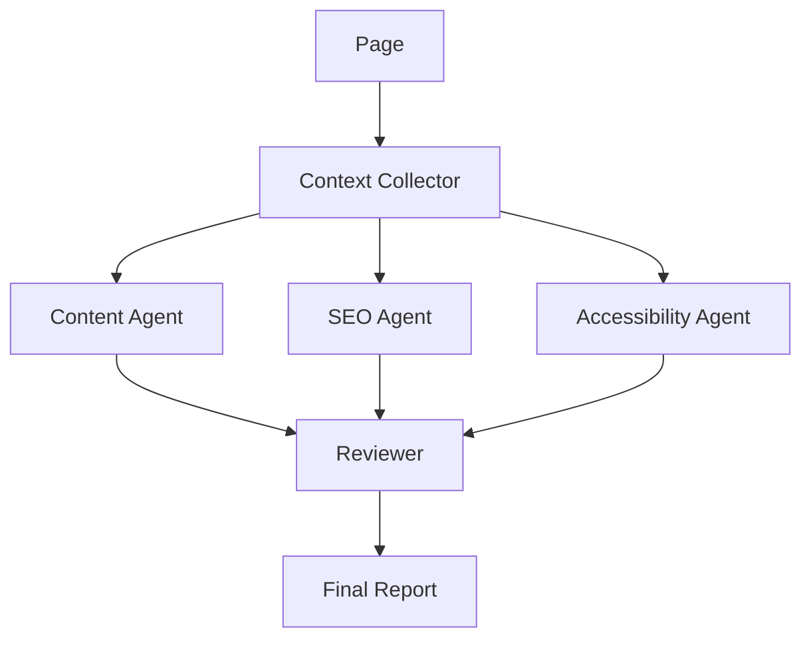

각 Agent는 단순히 이름만 다른 LLM이 아니다.

```text
Content Agent
  Evidence → Body, Heading, Description
  Rubric   → Coherence, Readability, Redundancy

SEO Agent
  Evidence → Title, Description, Heading, Links
  Rubric   → Relevance, Structure, Discoverability

Accessibility Agent
  Evidence → Image, Alt, Link, Semantic Structure
  Rubric   → Accessibility Criteria
```

처럼 **자신의 역할에 필요한 Context와 Prompt를 별도로 가진다.**

따라서 내가 생각하는 Multi-Agent의 핵심은 Agent의 수가 아니라,

> **Context Specialization + Prompt Specialization + Role Specialization**

이다.

이렇게 보면 Prompt Engineering과 Multi-Agent System은 서로 독립적인 기술이라기보다 자연스럽게 연결된다.

```text
Simple Prompt
      ↓
Evaluation Rubric
      ↓
Evidence-Grounded Prompt
      ↓
Structured Output
      ↓
Role-specific Prompt
      ↓
Specialized Agents
      ↓
Collaborative Evaluation
```

즉 하나의 Prompt가 담당하기 어려울 정도로 **평가 목적과 Evidence, Reasoning 방식이 이질적으로 분화될 때**, 그때 Multi-Agent 구조가 의미를 가질 수 있다고 생각한다.

## Multi-Agent가 항상 더 좋은 것은 아니다

그렇다고 Single-Agent를 Multi-Agent로 바꾸는 것이 항상 발전이라고 생각하지는 않는다.

Agent가 늘어나면 API 호출과 Token 사용량이 증가하고, 서로 충돌하는 의견을 조정해야 하는 새로운 문제도 생긴다.

예를 들어 Content Agent는

> "독자를 위해 Description을 조금 더 자세하게 작성하는 것이 좋다."

라고 판단하고,

SEO Agent는

> "Description이 길기 때문에 더 압축하는 것이 좋다."

라고 판단할 수도 있다.

그러면 이제 새로운 문제가 생긴다.

> **어느 Agent의 판단을 우선해야 하는가?**

여기서 Reviewer의 역할이 필요해진다.

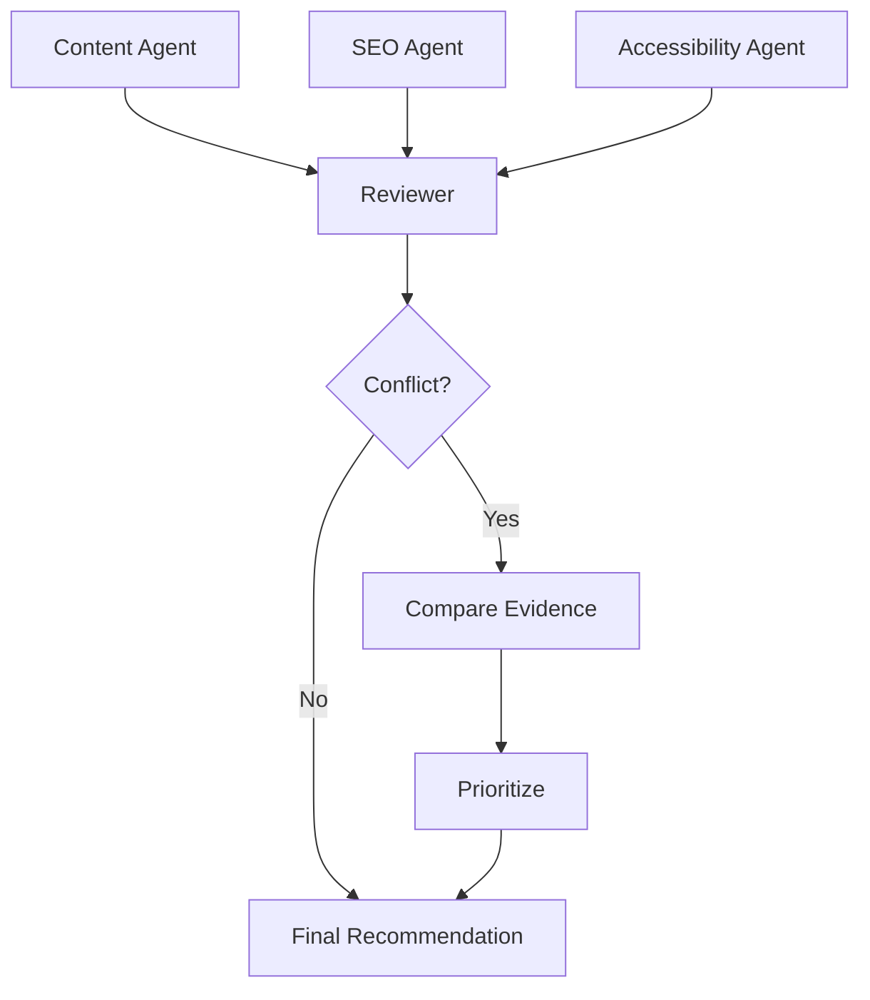

Reviewer는 단순히 세 결과를 합치는 것이 아니라 각 Agent가 제시한 주장과 근거를 비교하고, 충돌하는 경우 최종적인 우선순위를 결정해야 한다.

따라서 Multi-Agent를 적용할 이유는

> **"여러 Agent가 더 똑똑할 것 같아서"**

가 아니라,

> **하나의 Reasoning Process로 처리하기 어려울 정도로 문제의 역할·근거·평가 기준이 이질적이기 때문**

이어야 한다고 생각한다.

만약 하나의 Prompt로 충분히 안정적인 결과를 얻을 수 있다면 Single-Agent를 유지하는 것이 오히려 좋은 설계일 수 있다.

## Agentic System으로 간다면

Multi-Agent보다 더 관심이 가는 부분은 Agent가 단순히 페이지를 평가하는 것을 넘어 **필요한 정보를 스스로 선택하고 추가적으로 검증하는 구조**다.

현재 Pipeline은 정해져 있다.

```text
Page
 ↓
Summary
 ↓
LLM
 ↓
Review
```

하지만 실제 웹사이트 검수에서는 첫 번째 Context만으로 판단할 수 없는 경우가 생길 수 있다.

예를 들어 LLM이

> "이 페이지의 Internal Linking이 부족한 것 같다."

고 판단했다면 실제 사이트의 다른 글을 추가로 탐색해야 제대로 검증할 수 있다.

또는

> "이미지의 Alt Text가 이미지 내용을 충분히 설명하지 못한다."

를 판단하려면 HTML의 `alt` 문자열뿐 아니라 실제 이미지 자체가 필요할 수 있다.

이런 경우에는 고정된 Pipeline보다

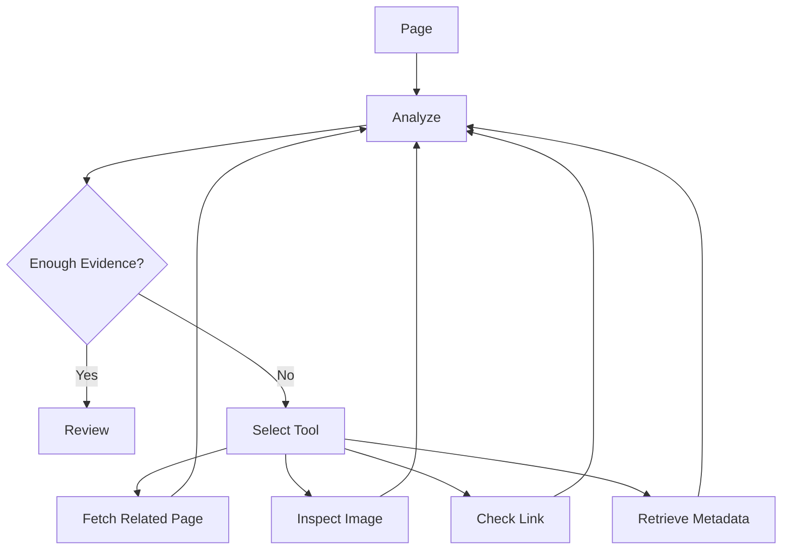

처럼 **현재 Evidence가 충분한지 판단하고 필요한 Tool을 선택하는 구조**가 더 적합하다.

이 단계부터는 단순히 LLM을 API로 호출하는 Pipeline과 Agentic System의 차이가 조금 더 분명해진다.

LLM이 답변만 생성하는 것이 아니라,

```text
Observe
   ↓
Reason
   ↓
Select Evidence / Tool
   ↓
Observe Again
   ↓
Evaluate
```

의 과정에 참여하기 때문이다.

## 서비스로 발전시킨다면

이러한 구조가 어느 정도 안정화된다면 URL 하나를 입력해 웹사이트 전체를 분석하는 서비스로 확장할 수 있다.

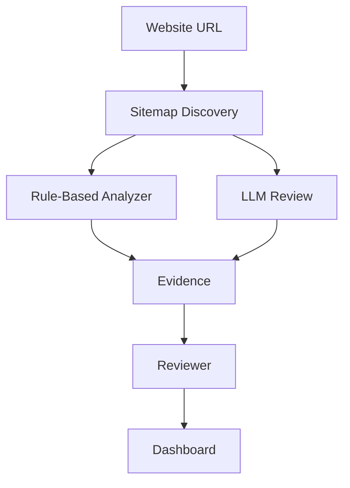

여기서 중요한 것은 단순히 LLM 결과를 예쁘게 보여주는 Dashboard를 만드는 것보다 **검수 결과를 실제 개발 Workflow와 연결하는 것**이라고 생각한다.

예를 들어 GitHub Actions와 연결한다면,

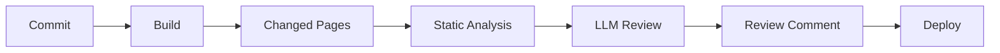

새로운 글이나 변경된 페이지에 대해서만 검수를 수행하고, 결과를 Pull Request나 Build Report에 남길 수 있다.

그리고 여기에서도 역할을 구분할 수 있다.

명확하게 판단할 수 있는

```text
Broken Link
Missing H1
Missing Alt
Invalid Metadata
```

같은 문제는 CI의 **Error**로 사용할 수 있다.

반면

```text
Description 개선
가독성
문맥
중복 표현
콘텐츠 구성
```

같은 LLM의 Semantic Evaluation은 배포를 막기보다는 **Recommendation**으로 제공하는 편이 적절하다.

LLM의 판단과 Deterministic Validation을 같은 신뢰 수준으로 취급하지 않는 것이다.

## Insight: LLM을 붙이는 것보다 중요한 것

처음 구현한 구조 자체는 단순하다.

```text
Sitemap → HTML → Context → LLM → Review
```

하지만 이를 확장해서 생각해보면 LLM 기반 시스템을 설계할 때 몇 가지 질문이 계속 따라온다.

```text
이 문제에 정말 LLM이 필요한가?
              ↓
판단에 필요한 Evidence는 무엇인가?
              ↓
어떤 Context를 모델에게 제공할 것인가?
              ↓
어떤 Rubric으로 판단하게 할 것인가?
              ↓
하나의 Reasoning으로 충분한가?
              ↓
역할을 분리해야 하는가?
              ↓
결과를 어떻게 검증할 것인가?
```

결국 LLM API를 호출하는 것 자체는 시스템의 작은 부분일 뿐이다.

오히려 중요한 것은 **LLM의 역할과 경계를 설계하는 것**이라고 생각한다.

이를 이번 Agent에 적용하면 다음과 같이 정리할 수 있다.

```text
Rule-Based Analysis
        │
        │  명확한 규칙
        ▼
Deterministic Evidence

Context Engineering
        │
        │  필요한 정보 선택
        ▼
Relevant Evidence

Prompt Engineering
        │
        │  판단 기준 정의
        ▼
Structured Reasoning

Multi-Agent
        │
        │  이질적인 역할 분해
        ▼
Specialized Reasoning

Reviewer
        │
        │  결과 비교 및 검증
        ▼
Final Decision
```

이렇게 보면 `Rule → LLM → Multi-Agent`가 단순히 기술을 하나씩 추가하는 단계는 아니다.

**문제가 복잡해질수록 필요한 추론 구조를 선택하는 과정**에 가깝다.

## 마치며

현재 Website Review Agent는 `sitemap.xml`에서 페이지를 수집하고 필요한 Context를 구성한 뒤 LLM으로 개선점을 생성하는 작은 시스템이다.

하지만 이 구조를 만들어보면서 더 관심이 생긴 부분은 기능 자체보다 **LLM을 시스템 안에서 어떤 역할로 사용할 것인가**였다.

모든 문제를 LLM에게 넘길 필요는 없다.

명확한 규칙으로 판단할 수 있다면 Code가 더 적합하고, 의미와 문맥을 이해해야 한다면 LLM이 강점을 가질 수 있다.

그리고 하나의 LLM이 너무 많은 서로 다른 판단을 수행해야 한다면 그때 역할별 Context와 Rubric을 분리하는 Multi-Agent 구조를 고려할 수 있다.

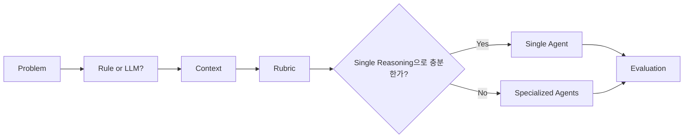

결국 내가 생각하는 방향은 **LLM을 많이 사용하는 시스템이 아니라, 필요한 곳에 적절한 형태로 LLM을 사용하는 시스템**이다.

앞으로 이 Agent도 같은 관점에서 Rule-Based Analysis, Structured Evaluation을 먼저 추가하고, 이후 역할 분리가 실제 검수 품질에 도움이 되는지를 확인하면서 Multi-Agent 구조로 확장해보려고 한다.


## 전체 코드
```python
#!/usr/bin/env python3
"""개인 웹사이트 LLM 검수 Agent — sitemap.xml 기준으로 전 페이지를 순회합니다."""

from __future__ import annotations

import json
import sys
import xml.etree.ElementTree as ET
from datetime import datetime, timezone
from pathlib import Path
from urllib.parse import urljoin, urlparse

import requests
from bs4 import BeautifulSoup

CONFIG_PATH = Path(__file__).with_name("config.json")
TIMEOUT = 20
MAX_TEXT = 6000  # 페이지당 LLM에 넘길 텍스트 길이


def load_config() -> dict:
    with CONFIG_PATH.open(encoding="utf-8") as f:
        cfg = json.load(f)

    if not cfg.get("api_key") or cfg["api_key"] == "YOUR_API_KEY":
        sys.exit("config.json 에 api_key 를 입력하세요.")
    if not cfg.get("url"):
        sys.exit("config.json 에 url 을 입력하세요.")

    cfg.setdefault("model", "gpt-4o-mini")
    cfg.setdefault("api_base", "https://api.openai.com/v1")
    return cfg


def fetch(url: str) -> str:
    r = requests.get(url, timeout=TIMEOUT, headers={"User-Agent": "SiteReviewAgent/1.0"})
    r.raise_for_status()
    r.encoding = r.apparent_encoding or "utf-8"
    return r.text


def site_origin(url: str) -> str:
    p = urlparse(url)
    return f"{p.scheme}://{p.netloc}"


def resolve_sitemap(url: str) -> str:
    """config url 이 sitemap.xml 이어도, 사이트 루트여도 동작합니다."""
    if urlparse(url).path.rstrip("/").endswith("sitemap.xml"):
        return url
    return urljoin(url.rstrip("/") + "/", "sitemap.xml")


def rewrite_to_base(page_url: str, base: str) -> str:
    """sitemap 의 로컬 호스트(0.0.0.0 등)를 config url 호스트로 교체합니다."""
    p = urlparse(page_url)
    return site_origin(base) + p.path + (f"?{p.query}" if p.query else "")


def sitemap_urls(base_url: str) -> list[str]:
    """sitemap.xml 에서 모든 페이지 URL 을 수집합니다. sitemap index 도 지원합니다."""
    root = ET.fromstring(fetch(resolve_sitemap(base_url)))
    ns = {"sm": "http://www.sitemaps.org/schemas/sitemap/0.9"}

    nested = [loc.text.strip() for loc in root.findall("sm:sitemap/sm:loc", ns) if loc.text]
    if nested:
        urls: list[str] = []
        for sm in nested:
            urls.extend(sitemap_urls_from(rewrite_to_base(sm, base_url)))
        raw = urls
    else:
        raw = [loc.text.strip() for loc in root.findall("sm:url/sm:loc", ns) if loc.text]

    return dedupe(rewrite_to_base(u, base_url) for u in raw)


def sitemap_urls_from(sitemap_url: str, base_url: str) -> list[str]:
    root = ET.fromstring(fetch(sitemap_url))
    ns = {"sm": "http://www.sitemaps.org/schemas/sitemap/0.9"}
    nested = [
        loc.text.strip()
        for loc in root.findall("sm:sitemap/sm:loc", ns)
        if loc.text
    ]
    if nested:
        urls = []
        for sm in nested:
            urls.extend(
                sitemap_urls_from(
                    rewrite_to_base(sm, base_url),
                    base_url
                )
            )
        return dedupe(urls)
    return [
        rewrite_to_base(loc.text.strip(), base_url)
        for loc in root.findall("sm:url/sm:loc", ns)
        if loc.text
    ]


def dedupe(urls) -> list[str]:
    seen, out = set(), []
    for u in urls:
        if u not in seen:
            seen.add(u)
            out.append(u)
    return out


def page_summary(html: str, url: str) -> str:
    """HTML 에서 제목·헤딩·본문·이미지 alt 등 검수에 쓸 요약만 추출합니다."""
    soup = BeautifulSoup(html, "lxml")
    for tag in soup(["script", "style", "noscript", "svg"]):
        tag.decompose()

    title = (soup.title.string or "").strip() if soup.title else ""
    headings = [
        f"{h.name}: {h.get_text(' ', strip=True)}"
        for h in soup.find_all(["h1", "h2", "h3"])
        if h.get_text(strip=True)
    ]
    links = [
        f"{a.get_text(' ', strip=True)} -> {a.get('href', '')}"
        for a in soup.find_all("a", href=True)[:40]
        if a.get_text(strip=True)
    ]
    images = [
        f"src={img.get('src', '')} alt={img.get('alt', '(없음)')}"
        for img in soup.find_all("img")[:30]
    ]
    text = " ".join(soup.get_text(" ", strip=True).split())[:MAX_TEXT]

    return "\n".join(
        [
            f"URL: {url}",
            f"Title: {title}",
            "Headings:",
            *headings[:30],
            "Links:",
            *links,
            "Images:",
            *images,
            "Body:",
            text,
        ]
    )


def ask_llm(cfg: dict, content: str) -> str:
    prompt = (
        "당신은 개인 웹사이트 검수 Agent 입니다.\n"
        "아래 페이지 요약을 보고 UI·콘텐츠·접근성·SEO·문구 측면에서 "
        "구체적이고 실행 가능한 개선점을 한국어로 bullet 로 적어 주세요.\n"
        "문제없으면 '특이사항 없음'이라고만 답하세요.\n\n"
        f"{content}"
    )

    endpoint = cfg["api_base"].rstrip("/") + "/chat/completions"
    res = requests.post(
        endpoint,
        headers={
            "Authorization": f"Bearer {cfg['api_key']}",
            "Content-Type": "application/json",
        },
        json={
            "model": cfg["model"],
            "temperature": 0.3,
            "messages": [
                {"role": "system", "content": "웹사이트 검수 전문가. 짧고 명확하게."},
                {"role": "user", "content": prompt},
            ],
        },
        timeout=90,
    )
    res.raise_for_status()
    return res.json()["choices"][0]["message"]["content"].strip()


def result_path(url: str, results_dir: Path) -> Path:
    """URL path → results/ 아래 파일명 (예: /about/ → about.md)."""
    path = urlparse(url).path.strip("/") or "index"
    name = path.replace("/", "_")
    return results_dir / f"{name}.md"


def save_result(url: str, review: str, results_dir: Path) -> Path:
    body = "\n".join(
        [
            "# 페이지 검수 결과",
            "",
            f"- **URL**: {url}",
            f"- **검수 시각**: {datetime.now(timezone.utc).astimezone().strftime('%Y-%m-%d %H:%M:%S')}",
            "",
            "## 개선사항",
            "",
            review.strip(),
            "",
        ]
    )
    out = result_path(url, results_dir)
    out.write_text(body, encoding="utf-8")
    return out


def main() -> None:
    cfg = load_config()
    base = cfg["url"]
    print(f"사이트: {base}")
    print("sitemap.xml 수집 중...")

    urls = sitemap_urls(base)
    if not urls:
        sys.exit("sitemap.xml 에서 URL 을 찾지 못했습니다.")

    results_dir = Path(__file__).with_name("results")
    results_dir.mkdir(exist_ok=True)

    print(f"총 {len(urls)}개 페이지 (호스트: {site_origin(base)})\n")

    for i, url in enumerate(urls, 1):
        print(f"[{i}/{len(urls)}] {url}")
        try:
            summary = page_summary(fetch(url), url)
            review = ask_llm(cfg, summary)
        except Exception as e:
            review = f"(검수 실패) {e}"

        out = save_result(url, review, results_dir)
        print(review)
        print(f"→ {out.name}")
        print("-" * 40)

    print(f"\n저장됨: {results_dir}/ ({len(urls)}개 파일)")


if __name__ == "__main__":
    main()

```