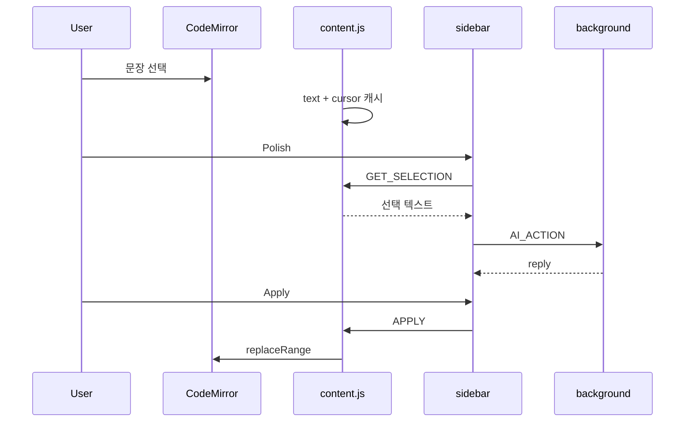

## 들어가며

논문을 Overleaf에서 쓰다 보면 AI를 쓰고 싶은 순간이 자주 온다.  
문장을 더 자연스럽게 다듬고 싶거나, 같은 내용을 짧게 줄이고 싶거나, citation이나 LaTeX가 어색하지 않은지 확인하고 싶을 때다.

문제는 도구가 없어서가 아니다. ChatGPT에 붙여 넣으면 된다.  
다만 그 순간마다 에디터를 벗어나야 한다. 문장을 복사하고, 새 탭에서 요청하고, 결과를 다시 가져와 덮어쓴다. 한두 번은 괜찮지만, 논문 문장을 고치는 작업이 반복되면 흐름이 계속 끊긴다.

그래서 만들고 싶은 것은 “더 똑똑한 모델”이 아니라 **Overleaf 안에서 바로 쓰는 Assistant**였다.  
문장을 고르고, 원하는 액션을 누르고, 결과를 확인한 뒤 에디터에 다시 넣는 일까지를 한 화면에서 끝내고 싶었다.

이번 글은 그 시리즈의 첫 번째 편이다.  
v0.2.0에서 **AI Paper Copilot**이라는 이름의 사이드바 UX와, 선택부터 Apply까지의 기본 파이프라인을 잡은 과정을 정리한다.

## 무엇을 만들고 싶었는가

처음부터 복잡한 Agent를 만들 생각은 없었다.  
논문 작성 중에 자주 하는 다섯 가지 일만 사이드바에 두기로 했다.

- **Polish** — 학술 영어를 더 자연스럽게  
- **Shorten** — 의미를 유지한 채 짧게  
- **Review** — 논리/표현/문법 이슈 점검  
- **LaTeX Check** — 명령/문법 오류 점검  
- **Citation Check** — `\cite` 등 인용 사용 점검  

사용 흐름도 단순하게 잡았다.

```text
LaTeX 선택
    ↓
사이드바에서 액션 선택
    ↓
결과 확인
    ↓
Apply 또는 Copy
```

여기서 중요하게 본 기준은 하나였다.

> AI가 문장을 고쳐주는가보다, **고른 구간을 잃지 않고 다시 에디터에 넣을 수 있는가?**

외부 챗봇은 보통 앞부분만 해결한다.  
내가 만들고 싶은 Assistant는 뒷부분, 즉 논문 편집기와의 연결까지 포함해야 했다.

## 확장은 세 층으로 나눴다

Chrome Extension(Manifest V3)으로 구현했고, 역할은 의도적으로 나눴다.

```text
CodeMirror 에디터
        ↕
   content.js
        ↕
  sidebar (iframe)
        ↕
  background.js
```

- `content.js`는 Overleaf 페이지에 사이드바를 붙이고, 선택 구간을 기억하며, Apply 시 에디터를 직접 수정한다.  
- `sidebar/`는 사용자가 보는 Paper Copilot UI다. 선택 문구, 액션 버튼, 결과, Copy/Apply가 여기에 있다.  
- `background.js`는 `AI_ACTION`을 받아 액션별 프롬프트를 붙이고 응답을 돌려준다. 지금은 stub이고, 이후 LLM API만 연결하면 된다.

사이드바는 iframe으로 주입하고 content script와는 `postMessage`로 이야기한다.  
AI 요청만 `chrome.runtime.sendMessage`로 background에 보낸다.  
UI, 에디터 조작, 모델 호출을 한 파일에 몰아넣지 않은 이유는 다음 편에서 API나 에디터 버전만 바꿔도 전체 UX를 다시 짜지 않게 하기 위해서다.

## 한 번의 액션이 실제로 하는 일

표면적으로는 버튼을 하나 누르는 일이다.  
안에서는 선택이 여러 경계를 넘어간다.

1. 에디터에서 문장을 고르면 content script가 텍스트와 CodeMirror cursor를 캐시한다.  
2. 사이드바 액션을 누르면 최신 선택을 다시 가져온다.  
3. background에 `AI_ACTION`을 보내고 결과를 사이드바에 보여준다.  
4. Copy는 클립보드로, Apply는 캐시해 둔 선택 구간을 결과로 바꾼다.



Apply가 생각보다 까다로운 이유는 여기에 있다.  
화면에 보이는 문자열만 있으면 “무엇을 고칠지”는 알아도 “어디를 고칠지”는 모른다.  
그래서 CodeMirror 5 기준으로 `getCursor("from"/"to")`를 같이 저장하고, Apply 때 `replaceRange`로 그 구간만 교체한다.

이 부분을 먼저 고정한 이유는 단순하다.  
모델이 아무리 좋은 문장을 만들어도, 에디터에 정확히 들어가지 않으면 Assistant라고 부르기 어렵다.

## 이번 버전에서 끝난 것, 일부러 미룬 것

v0.2.0에서 맞춘 것은 제품의 겉모습이 아니라 **루프**다.

이전에는 확장을 열어 AI에 무언가를 보내는 정도에 가까웠다면,  
지금은 논문 작성 중에 고른 문장을 사이드바에서 다루고 다시 에디터로 되돌리는 형태가 됐다.  
액션별 system prompt도 미리 나눠 두었다. Polish는 LaTeX 명령을 유지한 채 문장만 다듬고, Review는 이슈를 bullet로 지적하도록 적어 두었다.

반대로 일부러 아직 하지 않은 것도 있다.

- LLM API는 연결하지 않았다. 지금은 액션별 stub 미리보기만 반환한다.  
- CodeMirror 6 전용 구간은 따로 대응하지 않았다. 지금은 CM5 API를 기준으로 동작한다.

처음부터 모델을 붙이지 않은 이유는, API 품질 문제를 에디터 연동 문제와 섞고 싶지 않아서다.  
Stub으로도 “선택 → 결과 → Apply”가 되는지 먼저 확인하는 편이 다음 작업을 단순하게 만든다.

## 결과 화면 (v0.2.0)

v0.2.0에서 확인한 것은 **AI Paper Copilot** 사이드바와 Chrome 확장 등록 상태다.  
선택 영역, 다섯 가지 액션, 결과, Copy / Apply까지 한 패널에 모였다. 아직 LLM은 stub이지만, 루프 자체는 이 화면에서 끝까지 돌아간다.

### AI Paper Copilot 사이드바

Overleaf 에디터에서 확장을 열면 사이드바가 표시된다.  
Polish / Shorten / Review / LaTeX Check / Citation Check 버튼과 결과 영역이 v0.2.0 UX의 기본 형태다.


### Chrome Extension 등록

`chrome://extensions`에 **Overleaf AI Extension 0.2.0**이 설치된 상태다.  
Manifest V3 확장으로, Overleaf 탭에서 content script와 sidebar iframe이 주입된다.


## 다음에 할 일

1편에서 파이프와 UX를 고정해 두면, 이후 문제는 비교적 선명해진다.

```text
Stub
  ↓
LLM API 연결
  ↓
액션별 Prompt / 출력 형식
  ↓
필요하면 CM6 선택/Apply 대응
```

다음 편에서는 stub 자리에 실제 모델을 넣고, CM6 bridge/스트리밍/LLM 파라미터까지 v0.4.0까지 다룬다. → [2편](/engineering/2026-08-31-overleaf-ai-assistant-2/)